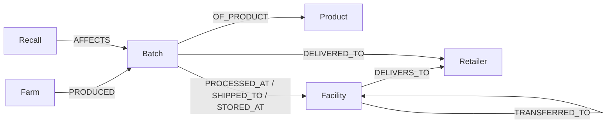

# Cascade

Food supply-chain recall tracer backed by **CognoDB** (openCypher over Bolt) using the official Neo4j JavaScript driver.

Cascade answers questions like:

- Which retailers are in the blast radius of a contamination event?
- Which farms and lots sit upstream of a store?
- What is the shortest farm → facility → store path for a lot?

## Why a graph database?

A recall is not a table join problem — it is a **path problem**.

Contaminated produce moves through packers, distributors, warehouses, and store banners. The useful questions are multi-hop:

1. From a recall event, walk every outbound logistics path to stores.
2. From a store, walk upstream to farms that supplied it.
3. Find shared facilities between two separate recall events.

In a relational schema those questions become recursive CTEs or wide join explosions with brittle intermediate tables. In a graph they are natural traversals over typed relationships (`PROCESSED_AT`, `SHIPPED_TO`, `STORED_AT`, `DELIVERS_TO`, `AFFECTS`). That is why CognoDB / openCypher is the right data layer for Cascade.

## Data model

```text
(:Farm)-[:PRODUCED]->(:Batch)-[:OF_PRODUCT]->(:Product)
(:Batch)-[:PROCESSED_AT|SHIPPED_TO|STORED_AT]->(:Facility)
(:Facility)-[:TRANSFERRED_TO]->(:Facility)
(:Facility)-[:DELIVERS_TO]->(:Retailer)
(:Batch)-[:DELIVERED_TO]->(:Retailer)
(:Recall)-[:AFFECTS]->(:Batch)
```



### Node labels

| Label | Key properties |
| --- | --- |
| `Farm` | `id`, `name`, `region`, `country` |
| `Product` | `id`, `name`, `category` |
| `Batch` | `id`, `lotCode`, `harvestDate`, `quantityKg` |
| `Facility` | `id`, `name`, `kind`, `city` |
| `Retailer` | `id`, `name`, `city`, `banner` |
| `Recall` | `id`, `title`, `pathogen`, `detectedAt`, `severity` |

## Stack

- Next.js (App Router) + TypeScript
- Official `neo4j-driver` over `bolt+s://`
- CognoDB Cloud free tier
- Seed script: `scripts/seed.ts`

## Setup CognoDB Cloud

1. Sign up at [https://console.cognodb.com/signup](https://console.cognodb.com/signup) (free tier, no credit card).
2. Create a free (`c0`) instance and pick a region.
3. Copy the connection URI (`bolt+s://<instance-id>.databases.cognodb.cloud`) and the one-time password for user `cognodb`.

## Run locally

```bash
cp .env.example .env.local
```

Fill in:

```env
NEO4J_URI=bolt+s://YOUR_INSTANCE_ID.databases.cognodb.cloud
NEO4J_USER=cognodb
NEO4J_PASSWORD=your_password_here
```

Then:

```bash
npm install
npm run seed
npm run dev
```

Open [http://localhost:3000](http://localhost:3000).

If CognoDB is down or credentials are wrong, the UI shows a clear offline banner and API routes return `503` with `DB_UNREACHABLE`.

## Main queries

All application Cypher is parameterized (no string-concatenated values). Source: `src/lib/queries.ts` and `cypher/queries.cypher`.

### 1. Multi-hop recall blast radius (2+ hops)

From a recall, traverse batches through facilities to retailers:

```cypher
MATCH (rec:Recall {id: $recallId})-[:AFFECTS]->(b:Batch)
MATCH path = (b)-[:PROCESSED_AT|SHIPPED_TO|STORED_AT|DELIVERED_TO|TRANSFERRED_TO*1..5]->(ret:Retailer)
RETURN DISTINCT ret, min(length(path)) AS hops
```

### 2. Query that is awkward in SQL — shared facilities across recalls

Find facilities that appear in the logistics path of two different recall events (variable-length overlap):

```cypher
MATCH (r1:Recall {id: $recallIdA})-[:AFFECTS]->(:Batch)-[:PROCESSED_AT|SHIPPED_TO|STORED_AT*1..3]->(fac:Facility)
MATCH (r2:Recall {id: $recallIdB})-[:AFFECTS]->(:Batch)-[:PROCESSED_AT|SHIPPED_TO|STORED_AT*1..3]->(fac)
WHERE r1 <> r2
RETURN DISTINCT fac
```

### 3. Shortest farm → retailer path

```cypher
MATCH (start:Farm {id: $farmId}), (end:Retailer {id: $retailerId})
MATCH path = shortestPath((start)-[*1..8]-(end))
RETURN path
```

## App pages

| Route | Purpose |
| --- | --- |
| `/` | Graph overview + active recalls |
| `/recall` | Contamination blast-radius explorer |
| `/upstream` | Store → farms/lots/facilities |
| `/path` | Shortest farm → store path |

## Project structure

```text
src/app/            UI routes + API handlers
src/components/     Shared UI
src/lib/            Neo4j driver, Cypher, types
scripts/seed.ts     Realistic seed data loader
cypher/             Reference Cypher
```

## Hosted demo & screen recording

- **Demo:** _add your deployed URL here (Vercel / similar)_
- **Screen recording:** _add link here_

### Screenshots

Add UI captures under `docs/screenshots/` and link them here after first run:

1. Overview
2. Recall Trace
3. Store Upstream
4. Farm → Store path

## Deploy (Vercel)

CognoDB stays in the cloud — you only deploy this Next.js app. Do **not** put the database on Vercel.

1. Push the repo to GitHub (do not commit `.env.local`).
2. Import the project in [vercel.com](https://vercel.com) → Add New Project.
3. In Vercel → Project → Settings → Environment Variables, add:

| Name | Value |
| --- | --- |
| `NEO4J_URI` | your `bolt+s://...` URI |
| `NEO4J_USER` | `cognodb` |
| `NEO4J_PASSWORD` | your CognoDB password |

4. Deploy. Seed stays local/CI against CognoDB (`npm run seed`) — no seed step on Vercel.
5. Keep the CognoDB instance running until review is complete.

Or from the project folder (after `npx vercel login`):

```bash
npx vercel
npx vercel env add NEO4J_URI
npx vercel env add NEO4J_USER
npx vercel env add NEO4J_PASSWORD
npx vercel --prod
```

## Submission
Include the GitHub repository URL and hosted demo link.
